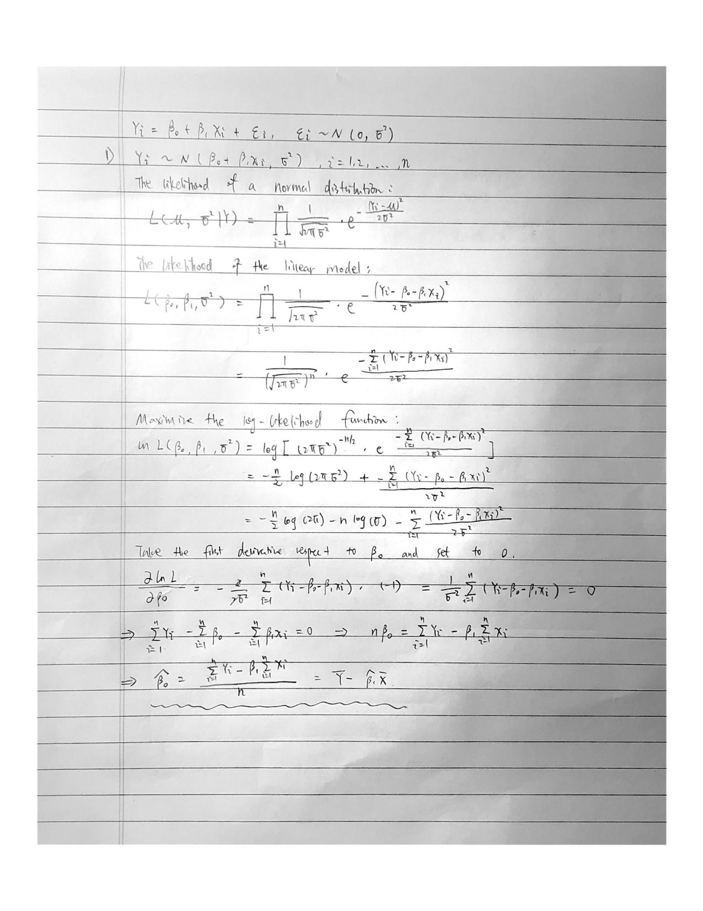
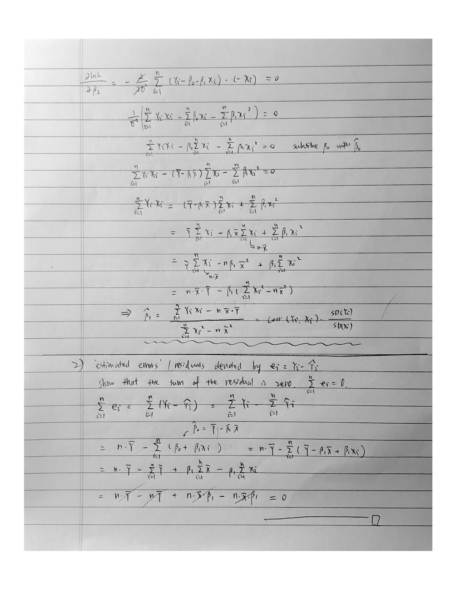

```{r message=FALSE}
#initial setup
library(tidyverse)
library(arsenal)
library(faraway)
library(broom)
theme_set(theme_minimal() + theme(legend.position = "bottom"))

options(
  ggplot2.continuous.colour = "viridis",
  ggplot2.continuous.fill = "viridis"
)

scale_colour_discrete = scale_color_viridis_d
scale_fill_discrete = scale_fill_viridis_d
```

## Problem 1

Given the non-normal distributions, now you are asked to use an alternative, non-parametric test
to assess and comment on the difference in Ig-M levels between the two groups (please ignore
unanswered and missing values). You can use R to perform the calculations, but make sure you
state test that you used, the hypotheses, test statistic, p-value and provide interpretation in the
context of the problem.

#### solution

```{r message=FALSE}
#load antibodies dataset
antibodies = read_csv("./data/Antibodies.csv") %>%
  drop_na() #remove NA values

#extract IgM values for Normal group
Normal = 
  antibodies %>%
  filter(Smell == "Normal") %>%
  pull(Antibody_IgM)

#extract IgM values for Altered group
Altered=
  antibodies %>%
  filter(Smell == "Altered") %>%
  pull(Antibody_IgM)
```

We first loaded the antibodies dataset and extract Ig-M levels for both Normal and Altered groups.Then we're going to do test for normality on both groups.

```{r message=FALSE}
#Graphic methods to test for normality
par(mfrow=c(2,2))
hist(Normal, xlab="Antibody Ig-M levels", freq=T, main="Normal Group")
hist(Altered, xlab="Antibody Ig-M levels", freq=T, main="Altered Group")
qqnorm(Normal, col=2, pch=19, cex=1.5)
qqline(Normal, col = 1,lwd=2,lty=2)

qqnorm(Altered, col=2, pch=19, cex=1.5)
qqline(Altered, col = 1,lwd=2,lty=2)
```

From both the histograms and Quantitle Quantitle plots, we found both groups failed their normality assumptions. Hence, we're going to use non-parametric Wilcoxon-Rank Sum Test to assess whether there is difference in Ig-M levels between the Normal and Altered groups since both groups have more than 10 observations and we're under normal-approximation. First, we establish our hypotheses:


$$
\begin{split}
H_0: the \ medians \ of \ the \ two \ populations \ are \ equal\\
H_1: the \ medians \ of \ the \ two \ populations \ are \ not \ equal\\
\end{split}
$$

```{r}
#check if there is ties in the data
duplicated.data.frame(antibodies$Antibody_IgM)
```

Since there is no ties in the data, we're going to use test statistics with no ties

```{r message=FALSE}
# Non-parametric Wilcoxon-Rank Sum test: two-independent groups
res = wilcox.test(Normal, Altered, mu=0)
# add the n1(n1+1)/2 term
res$statistic = res$statistic + length(Normal)*(length(Normal)+1)/2
res
Test_statistics = (abs(res$statistic-(length(Normal)*(length(Normal)+length(Altered)+1))/2)-0.5)/sqrt(((length(Normal)*length(Altered))/12)*(length(Normal)+length(Altered)+1))
Test_statistics #T score
qnorm(0.975) #critical value for 0.05 significance level
```

$$
\begin{split}
T = \frac{|T_1-\frac{n_1(n_1+n_2+1)}{2}|-\frac{1}{2}}{\sqrt{(\frac{n_1n_2}{12})(n_1+n_2+1)}} \\
T = \frac{|9157-\frac{81(81+178+1)}{2}|-\frac{1}{2}}{\sqrt{(\frac{81*178}{12})(81+178+1)}} = 2.45563\\
Z_{1-\alpha/2} = 1.959964 \\
T>Z_{1-\alpha/2} \\
Under~Normal-Approximation: n_1 \ and \  n_2 >10
\end{split}
$$
We got T = `r Test_statistics`, p-value = 0.01406 and T is greater than the critical value($Z_{1-\alpha/2}$ = `r qnorm(0.975)`).Since the test statistic is greater than the critical value and p-value is less than 0.05, we reject the Null hypothesis and conclude that at significance level of 0.05, the medians of Ig-M levels between the control and altered groups are different. 

-------------------

## Problem 2

 
 
 
 
 -----------------------------
 
 
  

-----------------

## Problem 3

#### solution

```{r message=FALSE}
#load the gpa data
gpa = read_csv("./data/GPA.csv")
```

### 1)

```{r}
#Scatter plot with regression line overlaid  
gpa %>%
  ggplot(aes(ACT,GPA)) +
  geom_point() +
  ggtitle("Scatter Plot of ACT Test Score and Freshman Year GPA") +
  geom_smooth(method='lm', se=FALSE, color='red')
```
```{r}
GPA = gpa$GPA
ACT = gpa$ACT
lm1 = lm(GPA~ACT)
# Summarize regression
summary(lm1)
# Get the critical t value for alpha=0.05 and n-2 df
qt(0.975, 118)
# calulate test statistics 
Test_statistics_t = (summary(lm1)$coefficients[2,1])/(summary(lm1)$coefficients[2,2])
```

Since we're going to test whether there is a linear association exists between student’s ACT
score and GPA,  our null hypothesis will be $\beta_1 = 0$. The hypotheses, test statistics and critical value are written below:

$$
H_0:\beta_1=\beta_{10}=0 \\
H_1:\beta_1\neq \beta_{10} \\
t = \frac{\hat{\beta}_1-\beta_{10}}{se(\hat{\beta}_1)} \\
t = \frac{0.03883-0}{0.01277} = 3.039777 \\
t_{n-2,1-\alpha/2} = 1.980272 \\
|t|>t_{n-2,1-\alpha/2}
$$

We got test statistics `r Test_statistics_t` which is larger than the critical value `r qt(0.975, 118)`. Hence we reject the null hypothesis and conclude that at significance level of 0.05, there is a significant linear association between s between student’s ACT score (X) and GPA at the end of the freshman year (Y). 

### 2)

$$
\hat{Y} = \hat{\beta}_0 + \hat{\beta}_1X \\
GPA = 2.11405 + 0.03883*ACT
$$

### 3)

```{r}
#calculate the 95% CI for the slope

coef<-summary(lm1)$coefficients[2,1] 
err<-summary(lm1)$coefficients[2,2] 
slope_int<-coef + c(-1,1)*err*qt(0.975, 118)
slope_int
```
The 95% confidence interval for $\beta1$ is (`r slope_int`) which does not include zero. We are 95% confidence that the true slope(the expected increase in GPA for one point increase in ACT score) will between those two values. If the confidence interval includes zero, then we conclude that there is no evidence of a relationship between the predictor X(ACT score) and the response Y(freshman year GPA) in the population or we fail to reject the null hypothesis.

### 4)

```{r warning==FALSE}
new <- data.frame(ACT = 28)
predict.lm(lm1, new, interval = "confidence")
```
The 95% interval estimate of the mean freshman GPA for students whose ACT test score is 28 is (3.061384,3.341033.). We are 95% confidence that the true freshman year GPA will lay between 3.061384 and 3.341033 for students whose ACT test score is 28. 

### 5)

```{r}
#Prediction interval
predict.lm(lm1, new, interval = "prediction")
```
The 95% prediction estimate of the freshman GPA for Anne who obtained a score of 28 on the entrance test is (1.959355,4.443063). We are 95% confidence that the true freshman year GPA for Anne who obtained a score of 28 on the entrance test will lay between 1.959355 and 4.443063.

### 6)

The prediction interval in part 5) is wider than the confidence interval in part 4). Because we're taking the error term into account in prediction interval, the standard error is augmented by 1. As a result, the prediction interval is wider than the confidence interval. 